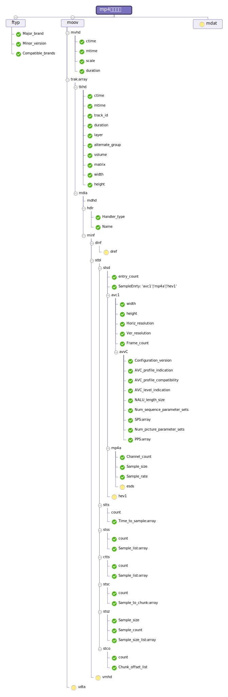

## 简介
这是一个mp4文件的结构解析包的nodejs实现，借鉴了[mp4包](https://www.npmjs.com/package/mp4 "mp4")的实现方法，但那位作者没有完成所有功能就停止更新了，这里是在他的基础上，重构了代码，但这个包更加纯粹，没有引用其它第三方包，之所以取名mp4reader，是向mp4reader软件的作者致敬，那个小工具很好用。拿到结构之后，就可以对关键帧进行解析，就可以实现nodejs对mp4的截帧。

## 支持解析的属性


## 用法

```
//引入方法
var { Mp4DecoderAll } = require( 'mp4reader')

//使用异步方法解析所有支持的结构 
let mp4Info = await Mp4DecodeAll('test.mp4')

console.log(mp4Info)
//打印结果对象 
// -1 没有解析成功

//成功结果
{
  ftyp: {
    Start_offset: 0,
    Box_type: 'ftyp',
    Major_brand: 'isom',
    Minor_version: 512,
    Compatible_brands: 'isomiso2avc1mp4'
  },
  moov: {
    offset: 32,
    size: 16080,
    mvhd: {
      ctime: '1904/1/1 上午8:00:00',
      mtime: '1904/2/13 上午10:21:12',
      scale: 1000,
      duration: 13255,
      Start_offset: 40,
      Box_size: 108,
      Box_type: 'mvhd',
      version: 0,
      flags: 0
    },
    udta: -1,
    trak: [ [Object], [Object] ]
  }
}

//example 2
//按模块导出
var { Mp4DecodeByModule } = require( 'mp4reader')
let mp4Info = await Mp4DecodeByModule(filename ,['hdlr','ftyp']) 
console.log(mp4Info)

//成功结果
{
  ftyp: {
    Start_offset: 0,
    Box_type: 'ftyp',
    Major_brand: 'isom',
    Minor_version: 512,
    Compatible_brands: 'isomiso2avc1mp4'
  },
  hdlr: [
    {
      Start_offset: 324,
      Box_size: 45,
      Box_type: 'hdlr',
      version: 0,
      flags: 0,
      Handler_type: 'vide',
      Name: 'VideoHandler'
    },
    {
      Start_offset: 8221,
      Box_size: 45,
      Box_type: 'hdlr',
      version: 0,
      flags: 0,
      Handler_type: 'soun',
      Name: 'SoundHandler'
    }
  ]
}
```

## 方法介绍
- `Mp4DecoderAll()`  mp4结构信息全部导出
- `Mp4DecodeFtyp()`  返回mp4结构ftyp盒子信息
- `Mp4FindMoov()`  返回moov盒子信息：位置，尺寸
- `getFileInfoAsync` 返回fs.stat类信息，包括文件大小等
- `Mp4DecodeByModule(filename ,option: [])` 参数为文件名、盒子名数组，可选参数有ftyp moov  mvhd trak tkhd   mdia hdlr  minf  stbl stsd stts  stss ctts  stsc stsz stco
比如Mp4DecodeByModule('test.mp4' ,['stsd', 'stss'])，上下级不冲突，但上级盒子会包含下级内容，如moov盒子将包含trak内容

## 更新记录

0.1.4 
【修改】主方法名称由 `Mp4DecoderAll` 改为 `Mp4DecodeAll`
【新增】模块化导出方法  `Mp4DecodeByModule`
【优化】调整了一下文档结构，更加合理

0.1.3
【优化】优化了一些问题


